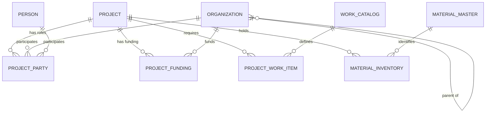
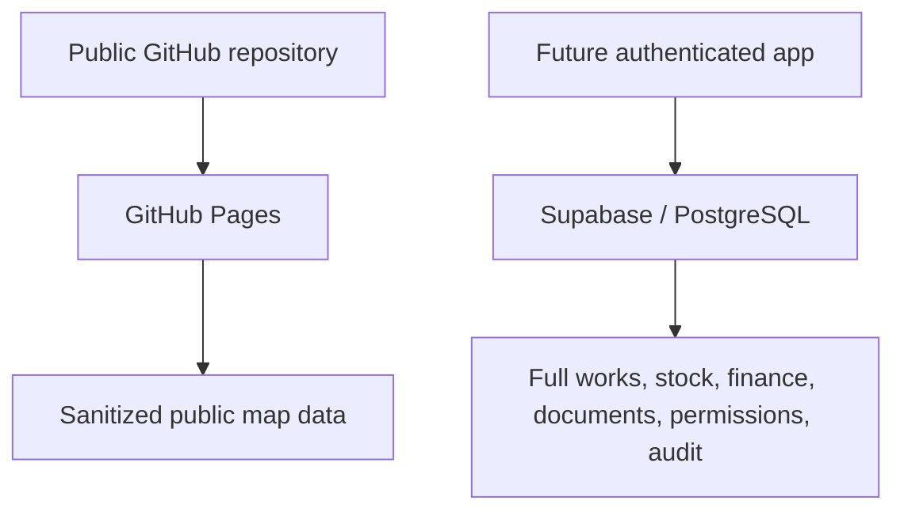

# v1.2 Operational Project Map — System Design

## 1. Repository audit

The v1.2 work was based on the checked-out source of truth from:

`FabinGurung/jp-ecosystem-project-map-v1`

Verified stable baseline:

| Item | Verified state |
|---|---|
| Default/production branch | `main` |
| Latest stable commit | `9c51563` |
| Stable tag | `v1.1.0` |
| Stable tag target | `9c51563` |
| Stable release | `v1.1.0 — Data-driven Stable Map` |
| Existing development branches | None before this work |
| Existing v1.2 tag/release | None |
| GitHub Pages source | `main` and `/ (root)` |
| Deployment method | Deploy from a branch |
| Validation workflow | `.github/workflows/validate-projects.yml` |
| Static-serving control | `.nojekyll` |

The stable files inspected before migration were:

- `index.html`
- `projects.csv`
- `map-config.json`
- `README.md`
- `CHANGELOG.md`
- `MOBILE_EDITING_GUIDE.md`
- `MIGRATION_CHECKLIST.md`
- `.github/workflows/validate-projects.yml`
- `.nojekyll`

The v1.1 architecture was:

```text
projects.csv
    ↓
index.html
    ↑
map-config.json
```

The v1.1 validator checked:

- required project columns
- duplicate `PK_ID`
- required identity, contractor, status, and coordinate values
- coordinate ranges
- status values from configuration
- progress from 0 to 100
- valid public flags

It did not validate normalized foreign keys because v1.1 had no normalized
related tables.

The Pages configuration is intentionally unchanged. The v1.2 validation Action
is still data/testing QA; it is not a site builder.

## 2. Current data audit

All seven current rows were migrated directly from the stable v1.1
`projects.csv`.

| Legacy | Project | Verified company | Latitude | Longitude | Status | Known progress |
|---|---|---|---:|---:|---|---:|
| P001 | 14 Bishal Paija | Rohini Engineering and Builders Pvt Ltd | 28.200667 | 84.018222 | Construction | Not entered |
| P002 | 17 Samir Man Ghubaju | Fishtail Builders Pvt Ltd | 28.196778 | 83.970778 | Construction | Not entered |
| P003 | 13 Hari Baral | Fishtail Builders Pvt Ltd | 28.226111 | 84.051389 | Construction | Not entered |
| P004 | 16 Yamuna Pun Adai | Fishtail Builders Pvt Ltd | 28.255500 | 83.979750 | Completed | 100% physical |
| P005 | 30 Sabitri Giri / Dipti Giri | Fishtail Builders Pvt Ltd | 28.160278 | 84.082500 | Construction | Not entered |
| P006 | 31 Sharada Adhikari | Fishtail Builders Pvt Ltd | 28.1657989 | 84.1153390 | Construction | Not entered |
| P007 | 15 Narayani Parajuli | Fishtail Builders Pvt Ltd | 28.1951253 | 83.9956481 | Approval | Not entered |

Values populated in v1.1:

- legacy project code
- internal project name
- display name
- contractor/company name
- coordinate
- status
- last-updated date
- public flag
- P004 physical progress

Values blank in v1.1:

- client
- project manager
- site engineer
- financial progress
- start date
- target completion date
- latest update
- photo URL
- details URL
- public notes

Values not present as concepts in v1.1:

- global project ID
- company-facing project code
- project sector
- government level
- implementation mechanism
- normalized organization ID
- funding relationships
- project work items
- material inventory

Those missing facts remain blank in v1.2.

## 3. Key design decisions

### 3.1 Organizations and people remain separate

The prototype uses:

- `organizations.csv`
- `people.csv`
- `project_parties.csv`

This was chosen instead of forcing homeowners into organizations or mixing
person and organization fields in one wide CSV.

Advantages:

- normal users can understand the difference
- organizations can have parent organizations, government levels, and ward
  numbers
- people do not need meaningless organization fields
- private personal data can remain outside the public repository
- a future PostgreSQL model can expose a unified `party` view if needed

Trade-off:

`project_parties.csv` uses `party_entity_type` plus `party_id`. The validator
must check the correct master according to the entity type. This is slightly
more complex than one generalized table, but clearer for human maintenance.

### 3.2 Companies are organizations

A separate permanent `companies.csv` is not used.

Companies are a subset of organizations:

| Organization ID | Code | Name | Type |
|---|---|---|---|
| ORG-000001 | FBL | Fishtail Builders Pvt Ltd | PRIVATE_COMPANY |
| ORG-000002 | REB | Rohini Engineering and Builders Pvt Ltd | PRIVATE_COMPANY |

Project role is stored separately. For the seven current records, each company
has a `CONTRACTOR` relationship in `project_parties.csv`.

This avoids identifying a company forever by comparing name text.

### 3.3 Identity, sector, execution, funding, and parties stay separate

A project can simultaneously have:

- one immutable global identity
- one human-facing company code
- a private or government/public sector
- a government level
- an administrative body
- a funding body
- an implementation mechanism
- an implementing body
- a contractor
- a project manager
- a site engineer

No overloaded value such as “ward government samiti project” is introduced.

### 3.4 Public CSV remains pragmatic

The future database can be more normalized. The current CSV model keeps one
row per entity or relationship while avoiding unnecessary tables that would
make a normal site update impossible.

## 4. Project-ID migration

| New global PK | Human map code | Preserved legacy code | Project | Executing company |
|---|---|---|---|---|
| PRJ-000001 | REB-001 | P001 | 14_bishal_paija | ORG-000002 / REB |
| PRJ-000002 | FBL-001 | P002 | 17_samir_man_ghubaju | ORG-000001 / FBL |
| PRJ-000003 | FBL-002 | P003 | 13_hari_baral | ORG-000001 / FBL |
| PRJ-000004 | FBL-003 | P004 | 16_yamuna_pun_adai | ORG-000001 / FBL |
| PRJ-000005 | FBL-004 | P005 | 30_sabitri_giri_dipti_giri | ORG-000001 / FBL |
| PRJ-000006 | FBL-005 | P006 | 31_sharada_adhikari | ORG-000001 / FBL |
| PRJ-000007 | FBL-006 | P007 | 15_narayani_parajuli | ORG-000001 / FBL |

Use each identifier for a different purpose:

| Identifier | Purpose | May it change? |
|---|---|---|
| `project_id` | Canonical PK and every future FK | No |
| `company_project_code` | Human-facing map/site code | Avoid changing after issue |
| `legacy_project_code` | Migration and old-document traceability | No |

Marker labels use `company_project_code`. Global IDs remain visible in project
details and GeoJSON.

## 5. Normalized relationship model



Simple meanings:

- One-to-one: one row is linked to exactly one other row. This model does not
  force many one-to-one relationships.
- One-to-many: one project can have many work items. Every work item belongs to
  one project.
- Many-to-many: one organization can participate in many projects, and one
  project can involve many organizations. `project_parties.csv` is the bridge.

## 6. Table purposes

| File | Purpose | Primary key |
|---|---|---|
| `organizations.csv` | Reusable companies, government bodies, wards, committees, consultants, suppliers, and institutions | `organization_id` |
| `people.csv` | Reusable individuals when public inclusion is approved | `person_id` |
| `projects.csv` | One public project record and its map identity | `project_id` |
| `project_parties.csv` | Project-to-person or project-to-organization roles | `project_party_id` |
| `project_funding.csv` | Funding sources independent from execution | `project_funding_id` |
| `work_catalog.csv` | Reusable work descriptions | `work_id` |
| `project_work_items.csv` | Project-specific BOQ/execution and progress rows | `project_work_id` |
| `materials_master.csv` | Reusable material definitions | `material_id` |
| `project_material_inventory.csv` | Project-specific inventory snapshots | `inventory_id` |

See `DATA_DICTIONARY.md` for every field.

## 7. Government/private classification

The following examples are illustrative only. They are not inserted into the
live CSV files.

### A. Private project

| Concept | Example value |
|---|---|
| project sector | `PRIVATE` |
| government level | blank |
| implementation mechanism | `PRIVATE_DIRECT` or `PRIVATE_CONTRACT` |
| owner/client | Person or organization relationship |
| funding | `PRIVATE` |
| contractor | Only when a contractor is appointed |

### B. Government Contractor Contract

| Concept | Example value |
|---|---|
| project sector | `GOVERNMENT_PUBLIC` |
| government level | `FEDERAL`, `PROVINCIAL`, or `LOCAL` |
| implementation mechanism | `GOVERNMENT_CONTRACTOR_CONTRACT` |
| administrative body | Government organization relationship |
| funding body | Independent funding relationship |
| implementing body | Government/public organization if required |
| contractor | Awarded contractor organization relationship |

### C. Government User Committee / Samiti work

| Concept | Example value |
|---|---|
| project sector | `GOVERNMENT_PUBLIC` |
| implementation mechanism | `GOVERNMENT_USER_COMMITTEE` |
| implementing body | Actual committee name |
| organization type | `USER_COMMITTEE` |
| funding | Government, committee contribution, mixed, or another verified source |

`USER_COMMITTEE`, Samiti, and Community Committee are the same implementation
concept in this system. No separate Samiti implementation value exists.

### D. Ward-administered Government Contractor work

| Concept | Example value |
|---|---|
| project sector | `GOVERNMENT_PUBLIC` |
| government level | `LOCAL` |
| administrative body | Ward Office organization |
| ward number | Stored on Ward Office organization |
| implementation mechanism | `GOVERNMENT_CONTRACTOR_CONTRACT` |
| contractor | Awarded company |
| funding body | Municipality, ward budget, or other verified source |

Ward is not a project sector.

### E. Ward-administered Government User Committee work

| Concept | Example value |
|---|---|
| project sector | `GOVERNMENT_PUBLIC` |
| government level | `LOCAL` |
| administrative body | Ward Office organization |
| implementation mechanism | `GOVERNMENT_USER_COMMITTEE` |
| implementing body | Named User Committee / Samiti organization |
| funding | Municipality/ward plus any verified committee contribution |

Execution and funding remain independent. A user-committee implementation does
not mean the committee supplied 100% of the funds.

## 8. Work and BOQ model

### Reusable catalog

`work_catalog.csv` defines descriptions once. The package contains 29
user-provided work descriptions, including RCC, masonry, finishes, joinery,
waterproofing, metalwork, and roofing.

Only units explicitly established in the supplied examples were locked for the
first records. Unverified default units remain blank with a confirmation note.

### Project-specific work

`project_work_items.csv` stores:

- source group and source serial number
- optional project description override
- original unit and `No`
- planned, completed, and remaining quantity
- rate and amount fields
- preserved Factor
- work status and progress
- planned and actual dates
- provenance and data quality

No source work group was assigned to the seven projects because the correct
project association was not established.

### Quantity calculations

When all inputs are valid:

```text
remaining_quantity = planned_quantity - completed_quantity
progress_percent = completed_quantity / planned_quantity × 100
```

Progress is not calculated when planned quantity is blank, invalid, or zero.
Physical progress is not inferred from money.

### Factor

The Factor field is preserved, but its business definition is
`TO_BE_CONFIRMED`.

The system does not assume:

```text
amount = quantity × rate × factor
```

The validator never uses Factor to calculate amount.

### Broken Excel values

If a source contains `#REF!`:

- the numeric CSV field stays blank
- `data_quality_status` becomes `ERROR`
- `data_quality_issue` records the problem
- provenance fields preserve the source location

The literal spreadsheet-error token must not be stored in a numeric field.

## 9. Material-inventory model

`materials_master.csv` defines reusable materials. The first master includes:

- cement
- reinforcement steel
- sand
- aggregate
- bricks
- blocks
- tiles
- paint
- waterproofing materials
- timber
- UPVC items

`project_material_inventory.csv` stores one inventory snapshot per project and
material:

- on-site quantity
- reserved quantity
- available quantity
- unit
- storage location
- condition
- as-of date
- public/data-quality controls
- provenance

Current inventory rows are intentionally empty.

Future stock transactions can be added without redesigning the master:

```text
RECEIPT
ISSUE
RETURN
TRANSFER_IN
TRANSFER_OUT
ADJUSTMENT
WASTAGE
```

The transaction ledger is not implemented in v1.2.

## 10. Operational interface

The map remains the primary interface.

Selecting a marker or project-list item sets one shared active-project state
and opens:

```text
Project
├── Overview
├── Works
└── Materials
```

Desktop uses a right-side detail drawer. Mobile uses a scrollable bottom sheet.

The Leaflet popup stays compact:

- company project code
- project display name
- status
- View Project
- Directions

The app does not place BOQ rows inside a map popup.

## 11. Validation plan

The v1.2 validator checks:

- required files and headers
- duplicate primary keys
- duplicate company project codes and legacy codes
- identifier formats
- missing foreign keys
- project/company-code prefix consistency
- invalid coordinates
- unsupported project statuses
- controlled project sector, government level, and implementation mechanism
- controlled organization, role, funding, work-status, and condition values
- progress outside 0–100
- invalid dates
- invalid numeric values
- negative quantities or money
- `#REF!`, `#VALUE!`, `#DIV/0!`, `#N/A`, and related Excel errors
- work calculation consistency
- Factor definition
- inventory snapshot consistency warning
- public files containing obvious sensitive-contact or secret columns
- required data-quality explanations

The Action runs on pushes to `main` and `v1.2-operational-map` and on pull
requests affecting application/data files.

The Action remains separate from GitHub Pages deployment.

## 12. Public/internal architecture



The current repository is public. Hiding a row in JavaScript is not security.

Public-safe examples:

- approved project identity and location
- company code
- status
- verified sector and implementation mechanism
- approved physical progress
- approved government/committee name
- approved general update

Internal by default:

- financial progress
- detailed BOQ
- rates and amounts
- exact material stock
- procurement
- supplier balances
- internal remarks
- private client details
- named staff where publication has not been approved

Sensitive:

- passwords and API keys
- bank details
- personal identity numbers
- private contact information
- restricted contracts/documents

## 13. Why data schema 2.0.0

Application `1.2.0` and data schema `2.0.0` serve different purposes.

The data schema is a major version because:

- `PK_ID=P001` is no longer the project primary-key contract
- `project_id=PRJ-000001` becomes the universal PK
- all future foreign keys use the new ID
- company names become organization references
- data is split across normalized relationships

This is a breaking structural change even though legacy codes are preserved.
Calling it data schema `1.1.0` would understate the compatibility change.

Historical v1.1 metadata remains unchanged:

- v1.1 app version: `1.1.0`
- v1.1 data schema: `1.0.0`

## 14. Safe migration sequence

The recommended review history is:

1. Document repository audit, schema decision, privacy, and migration.
2. Add organization/person masters and relationship files.
3. Add global, company, and legacy project identifiers.
4. Add work and material masters plus empty project-specific templates.
5. Replace inline validation with the reusable cross-file validator.
6. Update marker/list/search/GeoJSON logic to canonical IDs and company codes.
7. Add Overview, Works, and Materials project detail views.
8. Add responsive desktop drawer and mobile bottom sheet.
9. Run desktop, mobile, data, privacy, and regression tests.
10. Review through a pull request.
11. Promote `1.2.0-dev` to `1.2.0`.
12. Merge to `main`.
13. Create tag/release `v1.2.0`.

The live site remains on v1.1 until the pull request is intentionally merged.

## 15. Information still required

The following should be collected from verified sources before data entry:

- private vs government/public sector for each project
- implementation mechanism for each project
- government level where applicable
- actual client/owner relationships approved for publication
- administrative, funding, and implementing bodies
- project manager and site engineer if approved for publication
- start and completion dates
- project-specific BOQ source associations
- planned and completed work quantities
- public work-status updates
- approved material-inventory snapshots
- definition of Factor in the source workbook

Until then, the interface correctly displays missing operational data instead
of fabricating it.
